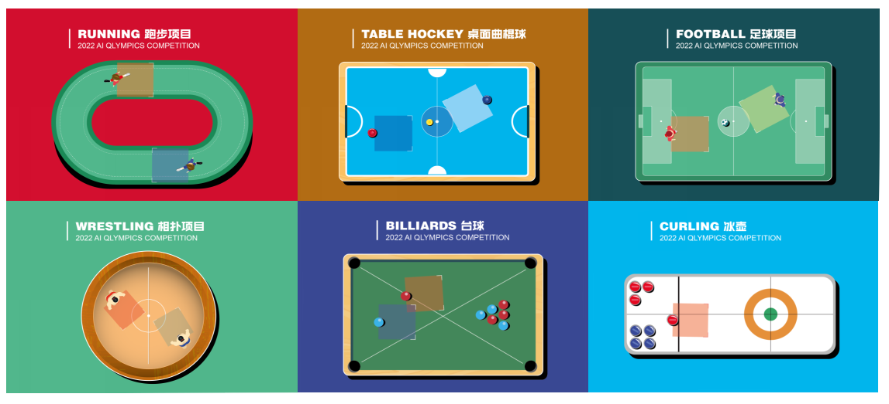

Introduction
============

AI-Olympics is easy to deploy. Using AI-Olympics,
researchers can design various gaming scenarios with shared map elements and multiple individual
agents. The characteristic of each map element is implied by its color, for example, a black line
represents a non-penetrable wall, a red line represents the awarding transferable final and a green
line represents a penalising obstacle. Assembling the elements together we can build up a specific
map that includes both rewarding and hazardous area, and potentially various objectives for agent to
explore.

    AI-Olympics Competition